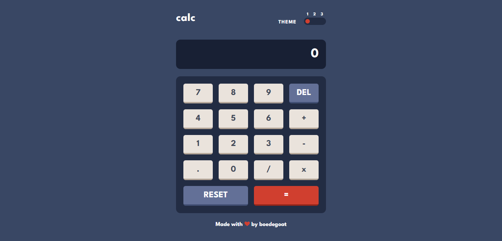

# Calculator App

<!-- screenshots here -->

A challenge from [frontendmentor.io](https://www.frontendmentor.io/)

## Overview

### Links

- [Live Site](https://your-live-site-url.com)
- [Solution](https://www.frontendmentor.io/profile/boedegoat)

### The challenge

- See the size of the elements adjust based on their device's screen size
- Perform mathematical operations like addition, subtraction, multiplication, and division
- Adjust the color theme based on their preference
- **Bonus**: Have their initial theme preference checked using `prefers-color-scheme` and have any additional changes saved in the browser

## My process

### Built with

- Semantic HTML5 markup
- Flexbox
- CSS Grid
- Typescript
- Mobile-first workflow
- Tailwind CSS
- React

### What I learned

This is my first time building calculator with that all kind of calculation operator. At first I have some difficulities at making it, especially for calculation part, but as usual google always help me :). I learnt a lot about the concept of how calculator really works, and how to make it by using javascript.

### Useful Resources

1. [Figma](https://www.figma.com/) - Paste your project design mockups to check the size, colors, etc.
2. [Vite](https://vitejs.dev/) - Next Generation Frontend Tooling
3. [Stackoverflow](https://stackoverflow.com/questions/65040466/underline-element-and-increase-distance-between-them-on-navbar-with-sliding-unde) - Helps me to create theme switcher animation
4. [Freecodecamp](https://www.freecodecamp.org/news/how-to-build-an-html-calculator-app-from-scratch-using-javascript-4454b8714b98/) - This article from freecodecamp helps me to build the calculator

## Acknowledgments

Thank you very much to everyone who gave me feedback on my solution. It greatly assists me in improving my frontend development skills.
